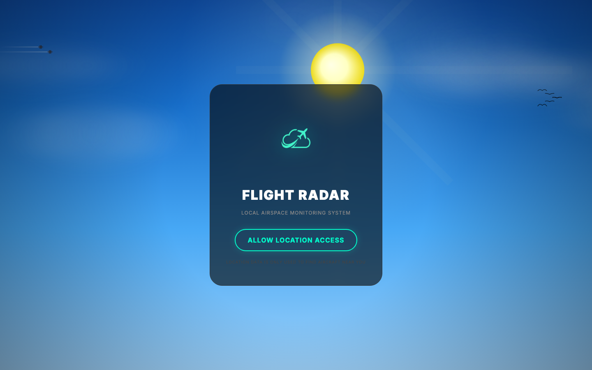
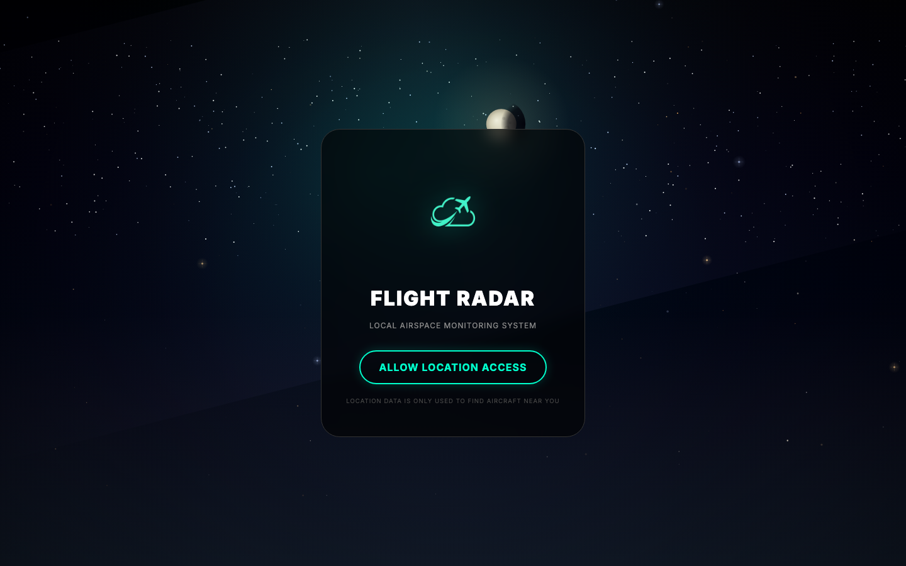
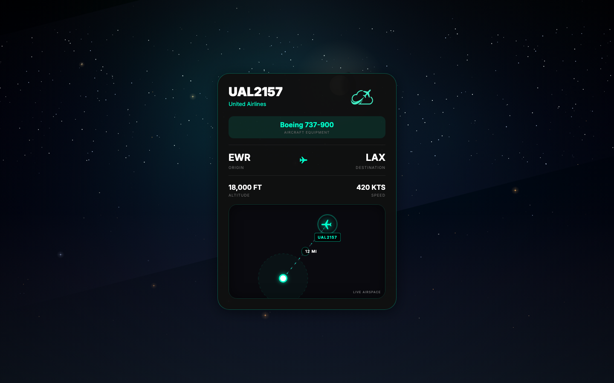
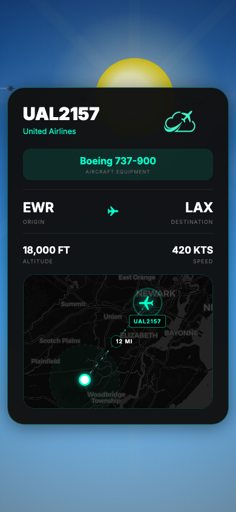

# Flight Radar

A real-time local airspace monitor that shows the nearest aircraft overhead — updated live via WebSocket, with a procedural animated sky, a Leaflet dark-map tracker, and smooth dead-reckoning animation between server ticks.

**Live site →** [flightaware.shivrathod.com](https://flightaware.shivrathod.com) *(if deployed)*

---

## Screenshots

<table>
<tr>
<td align="center" width="50%">

<br/><sub><b>Splash — animated day sky with intro sequence</b></sub>
</td>
<td align="center" width="50%">

<br/><sub><b>Splash — same screen, procedural night sky</b></sub>
</td>
</tr>
<tr>
<td align="center" width="50%">

<br/><sub><b>Live flight card — night mode, dark CartoDB map</b></sub>
</td>
<td align="center" width="50%">

<br/><sub><b>Mobile — iPhone-sized portrait view</b></sub>
</td>
</tr>
</table>

---

## What it does

Grant the app your location and it immediately connects to a WebSocket backend that scans OpenSky Network for the closest aircraft within radar range. Every update shows:

- **Callsign, airline, and aircraft type** (100+ ICAO codes mapped; unknown types auto-classified via GPT-4o-mini)
- **Route** — origin → destination airport codes
- **Live telemetry** — altitude, speed, heading
- **Flight progress bar** — interpolated from departure/arrival timestamps
- **Dark map** — Leaflet with CartoDB tiles, animated plane marker, dashed distance line, and dead-reckoning smooth movement between server ticks

When there's nothing overhead it sits in a scanning state. When a flight comes in the card transitions in.

---

## Technical highlights

| Area | Detail |
|---|---|
| **Real-time** | WebSocket connection; app reconnects automatically on drop |
| **Dead-reckoning** | `requestAnimationFrame` loop extrapolates plane position at reported speed + heading between server updates so the marker moves smoothly |
| **Procedural sky** | Canvas 2D sky engine with 24-hour sun/moon cycle, star field, clouds, birds, fireflies, and atmospheric haze — all driven by `Date` hour |
| **AI fallback** | Unknown ICAO codes hit GPT-4o-mini to get a display name and aircraft category; result is cached in-memory for the session |
| **Map** | Imperative Leaflet (no React-Leaflet) — rebuilt only when callsign changes, otherwise only marker/polyline positions update |
| **Responsive** | Single layout works on desktop and mobile with no media-query breakpoints — pure flexbox + viewport units |

---

## Stack

- **React 18** (single-file `App.jsx` — no router, no state library)
- **Leaflet** — direct DOM imperative API for map performance
- **Canvas 2D** — custom sky engine (no Three.js / WebGL)
- **Vite** — dev server + production build
- **Playwright** — screenshot automation (this README's images were generated with it)
- **AWS API Gateway WebSocket** — serverless backend endpoint

---

## Run locally

```bash
npm install
npm run dev        # http://localhost:5173
```

Requires a `VITE_OPENAI_API_KEY` in `.env` only if you want the AI aircraft-classification fallback; the app works fine without it.

```bash
npm run build      # production build → dist/
npm run preview    # preview the production build
```
